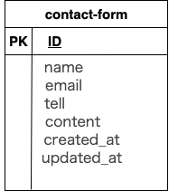

# laravel-docker-template

# お問い合わせフォーム

http://localhost/

## 環境構築

#### リポジトリをクローン

```
git clone git@github.com:ks-kanae/contact-form.git

```

#### Laravelのビルド

```
cd contact-form

git remote set-url origin git@github.com:ks-kanae/contact-form.git

git remote -v
```

#### Laravel パッケージのダウンロード

```
docker-compose up -d --build
```
docker-compose exec php bash
```
composer install
```

#### .env ファイルの作成

```
cp .env.example .env
```

#### .env ファイルの修正

```
DB_CONNECTION=mysql
- DB_HOST=127.0.0.1
+ DB_HOST=mysql
DB_PORT=3306
- DB_DATABASE=laravel
- DB_USERNAME=root
- DB_PASSWORD=
+ DB_DATABASE=laravel_db
+ DB_USERNAME=laravel_user
+ DB_PASSWORD=laravel_pass
```

#### キー生成

```
php artisan key:generate
```

#### マイグレーション・シーディングを実行

```
php artisan migrate
```

## 使用技術（実行環境）

フレームワーク：Laravel

言語：php:8.1-fpm

Webサーバー：Nginx 1.21.1

データベース：MySQL 8.0.36

## ER図



## URL

アプリケーション：http://localhost

管理画面：◯◯◯◯◯ ◯◯◯◯ ◯◯◯◯

phpMyAdmin：http://localhost:8080

